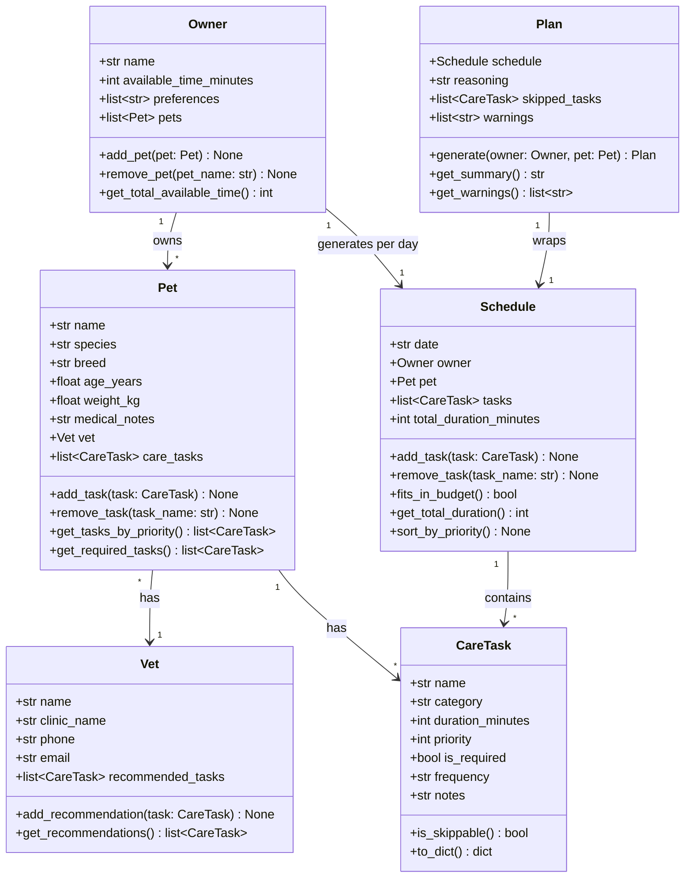

# PawPal+ — Brainstormed Object Model

## 1. Owner

Represents the person using the app.

**Attributes:**

- `name: str`
- `available_time_minutes: int` — total daily time budget for pet care
- `preferences: list[str]` — e.g., ["morning walks", "no baths on weekdays"]
- `pets: list[Pet]`

**Methods:**

- `add_pet(pet: Pet) -> None`
- `remove_pet(pet_name: str) -> None`
- `get_total_available_time() -> int`

---

## 2. Pet

Represents a pet owned by the owner.

**Attributes:**

- `name: str`
- `species: str` — e.g., "dog", "cat", "rabbit"
- `breed: str`
- `age_years: float`
- `weight_kg: float`
- `medical_notes: str` — e.g., "diabetic", "needs joint supplements"
- `vet: Vet | None`
- `care_tasks: list[CareTask]`

**Methods:**

- `add_task(task: CareTask) -> None`
- `remove_task(task_name: str) -> None`
- `get_tasks_by_priority() -> list[CareTask]`
- `get_required_tasks() -> list[CareTask]` — returns tasks that cannot be skipped

---

## 3. Vet

Represents the pet's veterinarian. Used to store contact info and medical recommendations.

**Attributes:**

- `name: str`
- `clinic_name: str`
- `phone: str`
- `email: str`
- `recommended_tasks: list[CareTask]` — tasks the vet has prescribed

**Methods:**

- `add_recommendation(task: CareTask) -> None`
- `get_recommendations() -> list[CareTask]`

---

## 4. CareTask

Represents a single pet care activity.

**Attributes:**

- `name: str` — e.g., "Morning Walk", "Feeding", "Medication"
- `category: str` — e.g., "exercise", "nutrition", "medical", "grooming", "enrichment"
- `duration_minutes: int`
- `priority: int` — 1 (low) to 5 (critical)
- `is_required: bool` — cannot be skipped (e.g., medication)
- `frequency: str` — e.g., "daily", "twice_daily", "weekly"
- `notes: str` — extra instructions

**Methods:**

- `is_skippable() -> bool`
- `to_dict() -> dict` — for serialization / display

---

## 5. Schedule

Holds the ordered list of tasks assigned to a specific time window. The raw output before the Plan wraps it with reasoning.

**Attributes:**

- `date: str` — ISO date string, e.g., "2026-03-28"
- `owner: Owner`
- `pet: Pet`
- `tasks: list[CareTask]`
- `total_duration_minutes: int`

**Methods:**

- `add_task(task: CareTask) -> None`
- `remove_task(task_name: str) -> None`
- `fits_in_budget() -> bool` — checks total_duration <= owner.available_time_minutes
- `get_total_duration() -> int`
- `sort_by_priority() -> None`

---

## 6. Plan

Wraps a Schedule and adds the reasoning/explanation shown to the user in the UI.

**Attributes:**

- `schedule: Schedule`
- `reasoning: str` — human-readable explanation of why tasks were chosen/ordered
- `skipped_tasks: list[CareTask]` — tasks that didn't fit in the time budget
- `warnings: list[str]` — e.g., "Medication skipped — please review"

**Methods:**

- `generate(owner: Owner, pet: Pet) -> Plan` — core scheduling logic: filters, sorts, fits tasks into budget
- `get_summary() -> str` — short text summary for UI display
- `get_warnings() -> list[str]`

---

## Relationships

```
Owner 1 ──────────── * Pet
Owner 1 ──────────── 1 Schedule (per day)
Pet   1 ──────────── * CareTask
Pet   * ──────────── 1 Vet
Schedule 1 ─────────── * CareTask
Plan  1 ──────────── 1 Schedule
```

---

## Key Constraints to Handle in Scheduling Logic

- Required tasks (e.g., meds) must always be included, even if time is tight.
- Tasks are prioritized by `priority` (5 = critical first).
- Total scheduled time must not exceed `owner.available_time_minutes`.
- Skipped tasks must be reported in `Plan.skipped_tasks` with a warning if `is_required`.

---

## Mermaid.js Class Diagram


